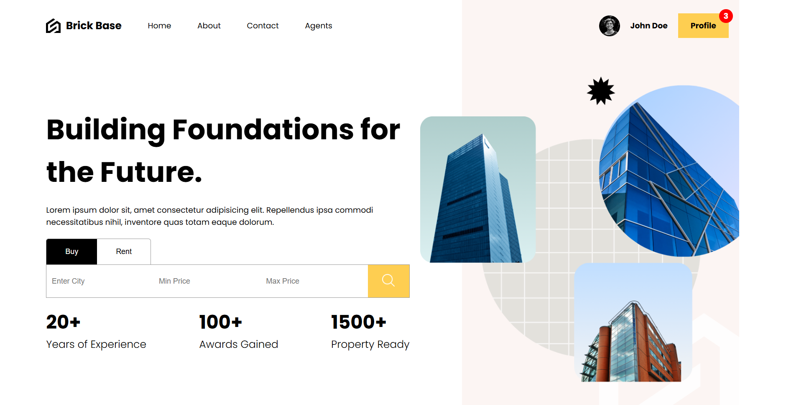

# 🏠 BrickBase - Building Foundations for the Future

**BrickBase** is a modern real estate platform built using the **MERN stack** (MongoDB, Express, React, and Node.js). This application provides users with innovative solutions for buying, selling, and managing properties, streamlining client interactions through a real-time chat interface.



## 🌟 Key Features

- **Property Listings**: Browse through detailed property listings with advanced filtering options based on location, price, and property type.
- **User Authentication**: Secure login and registration system for buyers, sellers, and property owners using JWT (JSON Web Tokens).
- **Property Management**: Property owners can easily list, update, and remove their properties from the platform.
- **Real-time Chat Interface**: Connect directly with property owners using a built-in chat feature powered by Socket.io, allowing for instant communication.
- **Interactive Map Integration**: View property locations on an interactive map using Leaflet, enhancing the browsing experience.
- **Responsive Design**: Fully responsive application that works seamlessly on desktops, tablets, and mobile devices.
- **Favorites System**: Users can save their favorite properties for easy access later.

## 🛠️ Technologies Used

### Frontend:
- **React.js**: A JavaScript library for building user interfaces.
- **React Router**: For navigation and routing within the application.
- **Redux**: For state management across components.
- **Axios**: For making HTTP requests to the backend API.
- **Leaflet**: For displaying maps and property locations.

### Backend:
- **Node.js**: JavaScript runtime for the server-side.
- **Express.js**: Framework for building the RESTful API.
- **MongoDB**: NoSQL database for storing user data, property listings, and chat messages.
- **Mongoose**: ODM for MongoDB to simplify data interactions.
- **Socket.io**: For real-time, bidirectional communication in the chat feature.

### Other Tools:
- **JWT**: For secure user authentication.
- **Bcrypt.js**: For password hashing and security.
- **Cloudinary**: For image storage and hosting for property images.

## 📄 Project Structure

### Frontend:
- **src/components**: Contains reusable React components (e.g., PropertyCard, Map, ChatWindow).
- **src/pages**: Contains the main pages such as Home, PropertyDetails, and UserDashboard.
- **src/store**: Redux store configuration and actions for state management.

### Backend:
- **routes**: Defines API endpoints for user authentication, property management, and chat.
- **controllers**: Contains the logic for handling requests and responses.
- **models**: MongoDB models for users, properties, and chat messages.
- **config**: Configuration files for database connection and environment variables.

## 💬 Real-Time Chat Feature

The **real-time chat** interface allows users to communicate directly with property owners. This feature is built using **Socket.io** for seamless messaging:

- **Private Chats**: Each conversation is specific to a user-property-owner pair.
- **Instant Messaging**: Messages are exchanged instantly in real time.
- **Chat History**: Conversations are saved in the database for easy retrieval later.

### How It Works:
1. Users can initiate a chat from the property details page.
2. The chat window allows for real-time messaging between the user and property owner.
3. All messages are stored in MongoDB, ensuring persistence.

## 📦 Installation and Setup

### Prerequisites:
- **Node.js** installed on your machine.
- **MongoDB** running locally or using a service like MongoDB Atlas.

### Backend Setup:

1. Clone the repository:
    ```bash
    git clone https://github.com/yourusername/real-estate-app.git
    cd real-estate-app/backend
    ```

2. Install backend dependencies:
    ```bash
    npm install
    ```

3. Create a `.env` file in the backend directory with the following variables:
    ```env
    MONGO_URI=your_mongodb_uri
    JWT_SECRET=your_jwt_secret
    CLOUDINARY_NAME=your_cloudinary_name
    CLOUDINARY_API_KEY=your_cloudinary_api_key
    CLOUDINARY_API_SECRET=your_cloudinary_api_secret
    ```

4. Run the backend server:
    ```bash
    npm run dev
    ```

### Frontend Setup:

1. Go to the frontend directory:
    ```bash
    cd ../frontend
    ```

2. Install frontend dependencies:
    ```bash
    npm install
    ```

3. Create a `.env` file in the frontend directory with the following variable:
    ```env
    REACT_APP_API_URL=http://localhost:5000
    ```

4. Run the frontend app:
    ```bash
    npm start
    ```

### Running the App:

- The backend will run on `http://localhost:5000/` and the frontend on `http://localhost:3000/`.
- Make sure MongoDB is running, and the backend server is connected to it.

## 🤝 Contribution

Feel free to contribute to this project! Fork the repository, make your changes, and submit a pull request.

## 📧 Contact

For any questions or feedback, feel free to reach out:
- **Email**: tallapragadaphaneendranikhil@gmail.com
- **GitHub**: [Phaneendra Nikhil](https://github.com/phaneendra-nikhil)
